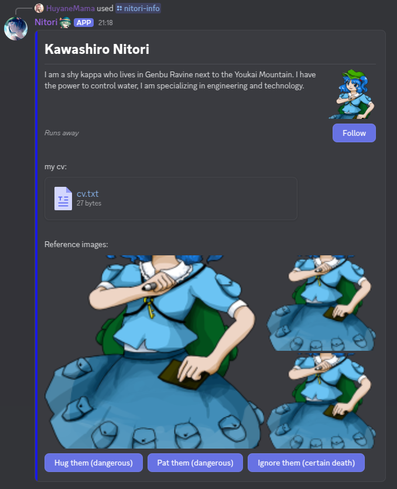

# Introduction

Using content with layout components allows you to structure your message in a more relaxed way, more than regular
`content`, `embeds` and `attachments` allow you.
Note that they can't be used at the same tim as `embeds` and `content` fields.

This guide focuses on usage, introducing components one by one.


## Text Display

Text display components are currently the only components that can display text.
Their functionality is equal to regular `content`, but they can be used in an un-ordered manner compared to it.

```py3
components = [
    create_text_display('# Kawashiro Nitori'),
    create_text_display(
        'I am a shy kappa who lives in Genbu Ravine next to the Youkai Mountain. '
        'I have the power to control water, I am specializing in engineering and technology.'
    ),
    create_text_display('# *Runs away*'),
]

```

These components support mentions and markdown as normal message content.
Additionally you can create a small spacing between them (about half the size of a line break) by using multiple of them,
one after the other.

## Separator

Speaking of the spacing! There is a separate separator component, that allows you to set how big the separator space
should be and whether there should be a divider.


```py3
components = [
    create_text_display('# Kawashiro Nitori'),
    create_separator(),
    create_text_display(
        'I am a shy kappa who lives in Genbu Ravine next to the Youkai Mountain. '
        'I have the power to control water, I am specializing in engineering and technology.'
    ),
    create_text_display('# *Runs away*'),
]
```

By default separators will have a divider and the spacing size will be small (around the size of one line break).
This should cover most common use case.

The divider can be removed and the spacing can be increased to large (around the size of one and half line breaks). 

```py3
create_separator(divider = False, spacing_size = SeparatorSpacingSize.large),
```

### Section

Text display components can be grouped into sections. These sections allow you to set a thumbnail, which can be an image
just like in the case of embeds, but it can also be a button.

```py3
components = [
    create_text_display('# Kawashiro Nitori'),
    create_separator(),
    create_section(
        create_text_display(
            'I am a shy kappa who lives in Genbu Ravine next to the Youkai Mountain. '
            'I have the power to control water, I am specializing in engineering and technology.'
        ),
        thumbnail = create_thumbnail_media(url),
    ),
    create_section(
        create_text_display('-# *Runs away*'),
        thumbnail = create_button('Follow', custom_id = 'nitori_info.follow'),
    ),
]
```

By stacking sections with thumbnail one after another you can create something unexpectedly charming.

Thumbnails can have an alternative description. They can also be set as spoiler. 

```py3
create_thumbnail_media(url, description = 'Kawashiro Nitori', spoiler = True)
```

## Media Gallery

A component designed to display previews of various media, including both images and videos.
Between one and ten media items can be used in a single media gallery.

```py3
url = 'https://en.touhouwiki.net/images/7/70/Th185Nitori.png'

components = [
    create_text_display('# Kawashiro Nitori'),
    create_separator(),
    create_section(
        create_text_display(
            'I am a shy kappa who lives in Genbu Ravine next to the Youkai Mountain. '
            'I have the power to control water, I am specializing in engineering and technology.'
        ),
        thumbnail = create_thumbnail_media(url),
    ),
    create_section(
        create_text_display('-# *Runs away*'),
        thumbnail = create_button('Follow', custom_id = 'nitori_info.follow'),
    ),
    create_separator(divider = False, spacing_size = SeparatorSpacingSize.large),
    create_text_display('Additional images:'),
    create_media_gallery(url, url, url),
]
```

Their layout currently can't be customized, but since they're displayed in the same way as image attachment previews
in regular messages, they're not particularly hard to understand.

By using `MediaGalleryItem`-s you can assign additional alternative description to each media. 
`MediaGalleryItem` can be set as spoiler.

```py3
create_media_gallery(
    MediaGalleryItem(url, description = 'Kawashiro Nitori sitting', spoiler = True),
    MediaGalleryItem(url, description = 'Kawashiro Nitori looking', spoiler = True),
    MediaGalleryItem(url, description = 'Kawashiro Nitori at table', spoiler = True),
)
```

## Attachment media

With attachment media you can display a single attachment without preview.

```py3
url = 'https://en.touhouwiki.net/images/7/70/Th185Nitori.png'

components = [
    create_text_display('# Kawashiro Nitori'),
    create_separator(),
    create_section(
        create_text_display(
            'I am a shy kappa who lives in Genbu Ravine next to the Youkai Mountain. '
            'I have the power to control water, I am specializing in engineering and technology.'
        ),
        thumbnail = create_thumbnail_media(url),
    ),
    create_section(
        create_text_display('-# *Runs away*'),
        thumbnail = create_button('Follow', custom_id = 'nitori_info.follow'),
    ),
    create_separator(divider = False, spacing_size = SeparatorSpacingSize.large),
    create_text_display('My cv:'),
    create_attachment_media('attachment://cv.txt'),
    create_separator(divider = False, spacing_size = SeparatorSpacingSize.large),
    create_text_display('Reference images:'),
    create_media_gallery(url, url, url),
]
```

Attachment media only allows you to use the `attachment://<file_name>` protocol.

You can mark attachments as spoilers.

```py3
create_attachment_media('attachment://cv.txt', spoiler = True)
```

## Container

You can have visibly distinct groups of components by using containers.
These allow you to place any other top-level component within them.
You can also use the `color` parameter to add a colored strip on the left side, similar to how it's done with embeds.


```py3
url = 'https://en.touhouwiki.net/images/7/70/Th185Nitori.png'

components = [
    create_container(
        create_text_display('# Kawashiro Nitori'),
        create_separator(),
        create_section(
            create_text_display(
                'I am a shy kappa who lives in Genbu Ravine next to the Youkai Mountain. '
                'I have the power to control water, I am specializing in engineering and technology.'
            ),
            thumbnail = create_thumbnail_media(url),
        ),
        create_section(
            create_text_display('-# *Runs away*'),
            thumbnail = create_button('Follow', custom_id = 'nitori_info.follow'),
        ),
        create_separator(divider = False, spacing_size = SeparatorSpacingSize.large),
        create_text_display('my cv:'),
        create_attachment_media('attachment://cv.txt'),
        create_separator(divider = False, spacing_size = SeparatorSpacingSize.large),
        create_text_display('Reference images:'),
        create_media_gallery(url, url, url),
        create_row(
            create_button('Hug them (dangerous)', custom_id = 'nitori_info.hug'),
            create_button('Pat them (dangerous)', custom_id = 'nitori_info.pat'),
            create_button('Ignore them (certain death)', custom_id = 'nitori_info.ignore'),
        ),
        color = Color.from_rgb(0, 0, 255),
    ),
]
```

You can also spoiler entire containers.

```py3
create_container(
    create_media_gallery(url, url, url),
    spoiler = True,
)

```

# Putting it together

Let's put a full command together using the components we've discussed above.

We already showcased a few buttons in the examples to show that [interactive components](interactive_components.md),
can also be used within layout components. Now, we're going to add basic handling for them.

```py3
from hata import (
    Color, SeparatorSpacingSize, create_attachment_media, create_button, create_container, create_media_gallery,
    create_row, create_section, create_separator, create_text_display, create_thumbnail_media
)
from hata.ext.slash import InteractionResponse


NITORI_IMAGE_URL = 'https://cdn.discordapp.com/attachments/604644832459227142/1418334260116455544/nitori-0000.png'
NITORI_CV = '*mechanical arm blue print*'
NITORI_COLOR = Color.from_rgb(0, 0, 255)

NITORI_CUSTOM_ID_BASE = 'nitori_info'
NITORI_CUSTOM_ID_FOLLOW = f'{NITORI_CUSTOM_ID_BASE}.follow'
NITORI_CUSTOM_ID_HUG = f'{NITORI_CUSTOM_ID_BASE}.hug'
NITORI_CUSTOM_ID_PAT = f'{NITORI_CUSTOM_ID_BASE}.pat'
NITORI_CUSTOM_ID_IGNORE = f'{NITORI_CUSTOM_ID_BASE}.ignore'


@Nitori.interactions(guild = TEST_GUILD)
async def nitori_info():
    """Information about Kawashiro Nitori."""
    return InteractionResponse(
        attachments = [
            ('cv.txt', NITORI_CV),
        ],
        components = [
            create_container(
                create_text_display('# Kawashiro Nitori'),
                create_separator(),
                create_section(
                    create_text_display(
                        'I am a shy kappa who lives in Genbu Ravine next to the Youkai Mountain. '
                        'I have the power to control water, I am specializing in engineering and technology.'
                    ),
                    thumbnail = create_thumbnail_media(NITORI_IMAGE_URL),
                ),
                create_section(
                    create_text_display('-# *Runs away*'),
                    thumbnail = create_button('Follow', custom_id = NITORI_CUSTOM_ID_FOLLOW),
                ),
                create_separator(divider = False, spacing_size = SeparatorSpacingSize.large),
                create_text_display('my cv:'),
                create_attachment_media('attachment://cv.txt'),
                create_separator(divider = False, spacing_size = SeparatorSpacingSize.large),
                create_text_display('Reference images:'),
                create_media_gallery(NITORI_IMAGE_URL, NITORI_IMAGE_URL, NITORI_IMAGE_URL),
                create_row(
                    create_button('Hug them (dangerous)', custom_id = NITORI_CUSTOM_ID_HUG),
                    create_button('Pat them (dangerous)', custom_id = NITORI_CUSTOM_ID_PAT),
                    create_button('Ignore them (certain death)', custom_id = NITORI_CUSTOM_ID_IGNORE),
                ),
                color = NITORI_COLOR,
            ),
        ],
    )


@Nitori.interactions(
    custom_id = [
        NITORI_CUSTOM_ID_FOLLOW,
        NITORI_CUSTOM_ID_HUG,
        NITORI_CUSTOM_ID_PAT,
        NITORI_CUSTOM_ID_IGNORE,
    ],
)
async def nitori_action(client, event):
    await client.interaction_component_acknowledge(event)
    await client.interaction_followup_message_create(event, 'You died')
```

The long awaited output:



----

<p align="left">
    <a href="./components.md">Previously: Components</a>
</p>

<p align="right">
    <a href="./interactive_components.md">Next up: Interactive components</a>
</p>
