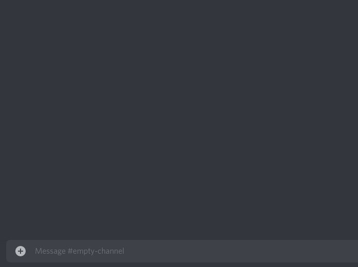
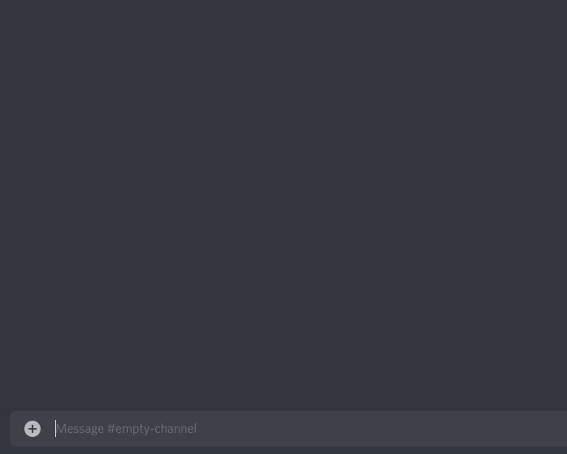
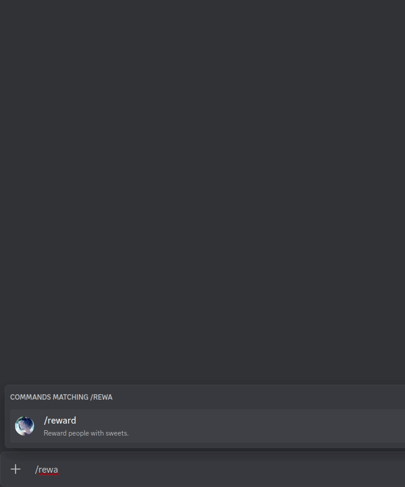

# Introduction

When it comes to interactions, slash commands and components are a great first step, but for longer inputs they are
not intuitive enough. This is when multi-field forms / modal interactions come into the picture.

## Building Forms

Forms are standalone components, with sub-components as fields.

Forms are limited to 5 sub-components. The allowed top level components are text displays and labels.
Labels are meant to be used to wrap an input component, giving them a "label" and a description.

## Limitations

- Up to `5` rows in each form.
- Each input component must be nested into a label.

# Form commands

To send a form response to the user just return the form from a slash or a component command, or use the
`Client.interaction_form_send` method.

```py3
from hata import InteractionForm, TextInputStyle, create_label, create_text_input

INTRODUCTION_FORM = InteractionForm(
    'Introduce yourself',
    [
        create_label(
            'What is your name?',
            component = create_text_input(
                min_length = 2,
                max_length = 128,
                custom_id = 'name',
            ),
        ),
        create_label(
            'Something about you?',
            component = create_text_input(
                style = TextInputStyle.paragraph,
                min_length = 64,
                max_length = 1024,
                custom_id = 'bio',
            ),
        ),
    ],
    custom_id = 'introduction',
)

@Nitori.interactions(guild = TEST_GUILD)
async def introduce_myself():
    """Creates an introduction embed after filling a form."""
    return INTRODUCTION_FORM
```

Defining `custom_id` for each component is not required, but its highly recommended since each received field is
matched by its `custom_id`.

You may add form commands to slasher by specifying what forms they should capture based on their `custom_id`.
Also, you can specify that you want to match forms submit interaction and not component interactions by
passing `target = ` either as `'form'` / `'form_submit'`.


```py3
from hata import Embed

@Nitori.interactions(custom_id = 'introduction', target = 'form')
async def introduction_form_submit(event, *, name, bio):
    return Embed(
        f'Hi, my name is {name}',
    ).add_field(
        'About me',
        bio,
    ).add_thumbnail(
        event.user.avatar_url,
    )
```


## Parameters

Positional parameters of form submit commands work in the same way as component commands'.
This means single and  multiple regex `custom_id`-s are both supported.

Form submits commands additionally also support multiple keyword only parameters as well.
Not like message component commands, form submit interactions can have multiple input components, therefor
they keyword parameters are matched of the fields of the submitted form.

```py3
import re
from hata import DiscordException, ERROR_CODES, Embed, InteractionForm, TextInputStyle, create_text_input
from hata.ext.slash import abort

ADD_ROLE_FORM = InteractionForm(
    'Add role', # Any dummy title does it
    [
        create_label(
            'Additional message to send?',
            component = create_text_input(
                style = TextInputStyle.paragraph,
                max_length = 512,
                custom_id = 'message',
            ),
        ),
    ],
)


@Nitori.interactions(guild = TEST_GUILD)
async def add_role(
    client,
    event,
    user: ('user', 'User to add role to'),
    role: ('role', 'The role to give'),
):
    """Add role to a user."""
    # Check for permissions
    if not event.user_permissions.manage_roles:
        abort('You need `manage roles` permission to invoke this command.')
    
    if not event.guild.cached_permissions_for(client).manage_roles:
        abort('I need `manage roles` permission to execute this command.')
    
    if not event.user.has_higher_role_than(role):
        abort('You must have higher role than the role you are trying to give.')
    
    if not client.has_higher_role_than(role):
        abort('I must have higher role than the role you are trying to give.')
    
    # Using `.copy_to` on forms works as well.
    return ADD_ROLE_FORM.copy_with(
        title = f'Add role {role.name} to {user.full_name}',
        custom_id = f'add_role.{user.id}.{role.id}',
    )


@Nitori.interactions(custom_id = re.compile('add_role\\.(\\d+)\\.(\\d+)'), target = 'form')
async def add_role(client, event, user_id, role_id, *, message):
    user_id = int(user_id)
    role_id = int(role_id)
    
    yield # acknowledge the even
    
    await client.user_role_add(user_id, (event.guild_id, role_id), reason = message)
    
    # Try to send DM to the poor being.
    channel = await client.channel_private_create(user_id)
    
    guild = event.guild
    role = guild.roles[role_id]
    
    embed = Embed(
        description = f'You have received role {role.name} in {guild.name}.',
    )
    
    # Since message doesn't have `required` nor `min_length` passed it can be `None`.
    if (message is not None):
        embed.add_field(
            'Message',
            message,
        )

    try:
        await client.message_create(channel, embed = embed) 
    except DiscordException as err:
        # Ignore the exception if the user has dm-s disabled.
        if err.code != ERROR_CODES.cannot_message_user: # user has dm-s disabled
            raise
    
    # Note: The user might not be cached at this point. Request it.
    # If you have user caching enabled + intent, it will do nothing.
    user = await client.user_get(user_id)
    
    embed = Embed(
        description = f'You gave {role.name} to {user.full_name}',
    )
    
    if (message is not None):
        embed.add_field(
            'Message',
            message,
        )
    
    yield embed
```

By annotating keyword parameters with string or with regex, you can customize what `custom_id`-s they are matching.
If the annotation is neither string nor regex pattern, it is ignored.

> Annotating a parameter with "regular" regex is pretty pointless. Could be good when updating old code
> and you want to support multiple `custom_id`-s.


```py3
import re
from hata import Embed, InteractionForm, TextInputStyle, create_text_input
from hata.ext.slash import abort

# Define constants

WAIFUS = {}

CUSTOM_ID_WAIFU_FORM = 'waifu.form'
CUSTOM_ID_WAIFU_AGE = 'waifu.age'
CUSTOM_ID_WAIFU_BIO = 'waifu.bio'
CUSTOM_ID_WAIFU_HAIR = 'waifu.hair'
CUSTOM_ID_WAIFU_NAME = 'waifu.name'

CUSTOM_ID_WAIFU_BIO_REGEX = re.compile('waifu\\.(?:description|bio)')

class Waifu:
    __slots__ = ('age', 'bio', 'hair', 'name', 'user')
    
    def __init__(self, age, bio, hair, name, user):
        self.age = age
        self.bio = bio
        self.hair = hair
        self.name = name
        self.user = user
    
    @property
    def embed(self):
        return Embed(
            self.name,
            self.bio,
        ).add_field(
            'age',
            self.age,
            inline = True,
        ).add_field(
            'hair',
            self.hair,
            inline = True,
        ).add_footer(
            f'Added by: {self.user:f}'
        )


# We will need these 3 in an example later

FIELD_INPUT_WAIFU_BIO = create_label(
    'Bio',
    component = create_text_input(
        style = TextInputStyle.paragraph,
        min_length = 64,
        max_length = 1024,
        custom_id = CUSTOM_ID_WAIFU_BIO,
    ),
)

FIELD_INPUT_WAIFU_AGE = create_label(
    'Age',
    component = create_text_input(
        min_length = 1,
        max_length = 1024,
        custom_id = CUSTOM_ID_WAIFU_AGE,
    ),
)

FIELD_INPUT_WAIFU_HAIR = create_label(
    'hair',
    component = create_text_input(
        min_length = 1,
        max_length = 1024,
        custom_id = CUSTOM_ID_WAIFU_HAIR,
    ),
)


WAIFU_FORM = InteractionForm(
    'Describe your waifu',
    [
        create_label(
            'Name',
            component = create_text_input(
                min_length = 2,
                max_length = 64,
                custom_id = CUSTOM_ID_WAIFU_NAME,
            ),
        ),
        FIELD_INPUT_WAIFU_BIO,
        FIELD_INPUT_WAIFU_AGE,
        FIELD_INPUT_WAIFU_HAIR,
    ],
    custom_id = CUSTOM_ID_WAIFU_FORM,
)

# Add command

@Nitori.interactions(guild = TEST_GUILD)
async def add_waifu():
    """Add a new waifu to the database!"""
    return WAIFU_FORM


@Nitori.interactions(custom_id = CUSTOM_ID_WAIFU_FORM, target = 'form')
async def waifu_add_form_submit(
    event,
    *,
    age: CUSTOM_ID_WAIFU_AGE,
    bio: CUSTOM_ID_WAIFU_BIO_REGEX,
    hair: CUSTOM_ID_WAIFU_HAIR,
    name: CUSTOM_ID_WAIFU_NAME,
):
    key = name.casefold()
    if key in WAIFUS:
        abort('A waifu with the given name is already added.')
    
    WAIFUS[key] = waifu = Waifu(age, bio, hair, name, event.user)
    
    return waifu.embed

```


```py3
# Get command

@Nitori.interactions(guild = TEST_GUILD)
async def get_waifu(
    name: ('str', 'Their name?')
):
    """Returns an added waifu."""
    try:
        waifu = WAIFUS[name.casefold()]
    except KeyError:
        abort(f'There is no waifu named like: {name}.')
    
    return waifu.embed


@get_waifu.autocomplete('name')
async def autocomplete_waifu_name(value):
    if (value is None):
        # Return the 20 oldest
        return [waifu.name for waifu, _ in zip(WAIFUS.values(), range(20))]
    
    value = value.casefold()
    return [waifu.name for key, waifu in WAIFUS.items() if value in key]
```


When using capturing groups or named capturing groups, you will get the captured values back as well. This can be
useful when dynamically generating form fields.

```py3

CUSTOM_ID_WAIFU_EDIT_BASE = 'waifu.edit.'
CUSTOM_ID_WAIFU_EDIT_REGEX = re.compile('waifu\\.edit\\.(.*)')
CUSTOM_ID_WAIFU_FIELD_ALL = re.compile('waifu\\.(?P<field>age|bio|hair)')

FIELD_INPUTS = {
    'age': FIELD_INPUT_WAIFU_AGE,
    'bio': FIELD_INPUT_WAIFU_BIO,
    'hair': FIELD_INPUT_WAIFU_HAIR,
}

FIELD_TO_ATTRIBUTE = {
    'age': Waifu.age,
    'bio': Waifu.bio,
    'hair': Waifu.hair,
}


@Nitori.interactions(guild = TEST_GUILD)
async def edit_waifu(
    event,
    name: ('str', 'Their name?'),
    field : (['age', 'bio', 'hair'], 'Which field to edit?'),
):
    """Edits a waifu. | You must own her."""
    key = name.casefold()
    try:
        waifu = WAIFUS[key]
    except KeyError:
        abort(f'There is no waifu named like: {name}.')
    
    if waifu.user is not event.user:
        abort('You can only edit waifus added by yourself.')
    
    field_input = FIELD_INPUTS[field]
    
    # We auto-fill the current value
    field_input = field_input.copy_with(value = FIELD_TO_ATTRIBUTE[field].__get__(waifu, Waifu))
    
    return InteractionForm(
        f'Editing {waifu.name}',
        [field_input],
        custom_id = f'{CUSTOM_ID_WAIFU_EDIT_BASE}{key}',
    )


@edit_waifu.autocomplete('name')
async def autocomplete_waifu_name(event, value):
    user = event.user
    
    if (value is None):
        # Return the 20 newest oldest
        return [waifu.name for waifu, _ in zip((waifu for waifu in WAIFUS.values() if waifu.user is user), range(20))]
    
    value = value.casefold()
    return [waifu.name for key, waifu in WAIFUS.items() if value in key and waifu.user is user]


@Nitori.interactions(custom_id = CUSTOM_ID_WAIFU_EDIT_REGEX, target = 'form')
async def waifu_edit_form_submit(
    key,
    *,
    edited_field: CUSTOM_ID_WAIFU_FIELD_ALL,
):
    # Both `group_dict` and `value` might be `None` at cases, so check them if you are not sure.
    group_dict, value = edited_field
    field = group_dict['field']
    
    waifu = WAIFUS[key]
    FIELD_TO_ATTRIBUTE[field].__set__(waifu, value)
    
    return waifu.embed

```




To capture multiple fields in one parameter you can use `*args`.

When using capturing groups in regex, each element will be a tuple, similar to the keyword parameters above.

```py3
import re
from hata import Embed, BUILTIN_EMOJIS, InteractionForm, TextInputStyle, create_text_input


CAKE_NAMES = [
    'butter', 'pound', 'sponge', 'genoise', 'biscuit', 'angel food', 'chiffon', 'baked flourless', 'unbaked flourless',
    'carrot', 'red velvet'
]

EMOJI_CAKE = BUILTIN_EMOJIS['cake']

CUSTOM_ID_RATE_CAKE = 'rate_cake'
CUSTOM_ID_RATE_CAKE_FIELD = 'rate_cake.field'


@Nitori.interactions(guild = TEST_GUILD)
async def rate_cakes(
    cake_1: ('str', 'Please rate this cake'),
    cake_2: ('str', 'Please rate this cake') = None,
    cake_3: ('str', 'Please rate this cake') = None,
    cake_4: ('str', 'Please rate this cake') = None,
    cake_5: ('str', 'Please rate this cake') = None,
):
    """Rate cakes."""
    # Filter 
    cakes = {cake for cake in (cake_1, cake_2, cake_3, cake_4, cake_5) if (cake is not None)}
    
    return InteractionForm(
        'Rate your cakes',
        [
            create_text_input(
                f'Please rate {cake}',
                min_length = 2,
                max_length = 128,
                custom_id = f'{CUSTOM_ID_RATE_CAKE_FIELD}[{cake}]',
            ) for cake in cakes
        ],
        custom_id = CUSTOM_ID_RATE_CAKE,
    )

@rate_cakes.autocomplete('cake-1', 'cake-2', 'cake-3', 'cake-4', 'cake-5')
async def autocomplete_cake_name(value):
    if value is None:
        return CAKE_NAMES[:20]
    
    value = value.casefold()
    return [cake_name for cake_name in CAKE_NAMES if (value in cake_name)]


@Nitori.interactions(custom_id = CUSTOM_ID_RATE_CAKE, target = 'form')
async def rate_cake_form_submit(
    event,
    *cakes: re.compile(f'{CUSTOM_ID_RATE_CAKE_FIELD}\\[(\\w+)\\]'),
):
    user = event.user
    embed = Embed(f'{user:f}\'s cake ratings').add_thumbnail(user.avatar_url)
    
    for (cake, ), rating in cakes:
        embed.add_field(cake, rating)
    
    return embed
```




### Selects

There are other input components outside the text input, which are the selects.
You can also use these in form submit commands alongside with text displays.

```py3
from hata import (
    InteractionForm, StringSelectOption, TextInputStyle, create_label, create_select, create_text_display,
    create_user_select
)
from hata.ext.slash import InteractionResponse


CUSTOM_ID_AWARD = 'award'

REWARD_FORM = InteractionForm(
    'Reward',
    [
        create_text_display(
            '**Who** and with **what** would like to reward them?\n'
            'What about telling them **why** as well?'
        ),
        create_label(
            'Who you want to reward?',
            'Select up to 10 users.',
            component = create_user_select(
                custom_id = 'users',
                min_values = 1,
                max_values = 10,
            ),
        ),
        create_label(
            'With what would you like to reward them?',
            component = create_string_select(
                [
                    StringSelectOption('Cake',),
                    StringSelectOption('Cookie',),
                    StringSelectOption('Pudding',),
                    StringSelectOption('Chocomilk',),
                ],
                custom_id = 'items',
                min_values = 1,
                max_values = 4,
            ),
        ),
        create_label(
            'Why would you like to reward them?',
            component = create_text_input(
                custom_id = 'reason',
                min_length = 1,
                max_length = 1000,
                style = TextInputStyle.paragraph,
            )
        ),
    ],
    custom_id = CUSTOM_ID_AWARD,
)


@Nitori.interactions(guild = TEST_GUILD)
async def reward():
    """Reward people with sweets."""
    return REWARD_FORM


@Nitori.interactions(custom_id = CUSTOM_ID_AWARD, target = 'form')
async def handle(event, *, users, items, reason):
    content_parts = []
    for user in users:
        content_parts.append(user.mention)
        content_parts.append(' ')
    content_parts.append('!!!\n\n')
    
    content_parts.append(event.user.mention)
    content_parts.append(' awarded you with:')
    for item in items:
        content_parts.append('\n- ')
        content_parts.append(item)
    content_parts.append('\n\n')

    content_parts.append('They say:\n')
    content_parts.append(reason)

    return InteractionResponse(
        allowed_mentions = None,
        content = ''.join(content_parts),
    )
```



### Attachment input

You may also input attachments with attachment input components.

```
from hata import create_attachment_input

component = create_attachment_input(
    custom_id = CUSTOM_ID,
)
```

This component is familiar to selects in the sense that they supports multiple "options to be selected",
or at this case, input multiple attachments.
Therefore when capturing an attachment component in a handler function,
it is always passed to it as a nullable tuple of attachments.

```
component = create_attachment_input(
    custom_id = CUSTOM_ID,
    min_values = 0,
    max_values = 10,
)
```

----

<p align="left">
    <a href="./interactive_components.md">Previously: Interactive components</a>
</p>

<p align="right">
    <a href="./embedded_activity_launch.md">Next up: Embedded activity launching</a>
</p>
