# Get started

To get started with Discord bots, first you need a discord application and add a bot to it. This tutorial will show to
how to do it.

First go to [Discord developer portal](https://discord.com/developers/applications).

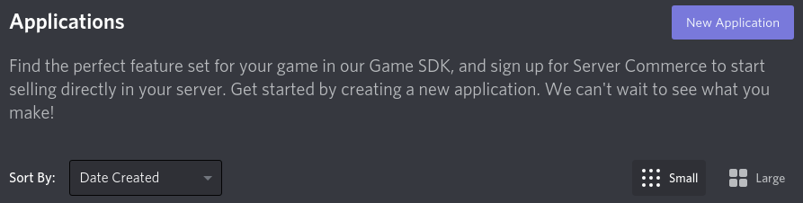

If you have any applications, or teams, they will show up here.

To create one application click on `New Application`, name it and `Create`.

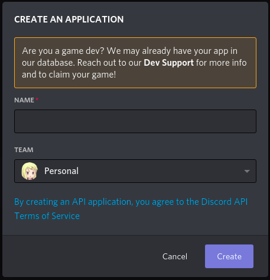

When the application is created, click on the `Bot` tab and `Add Bot`.

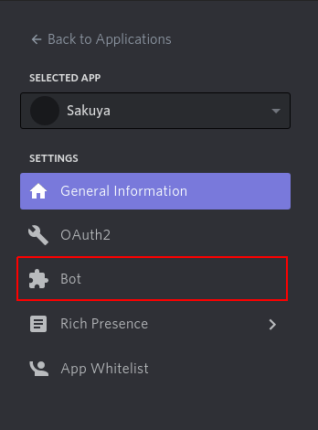

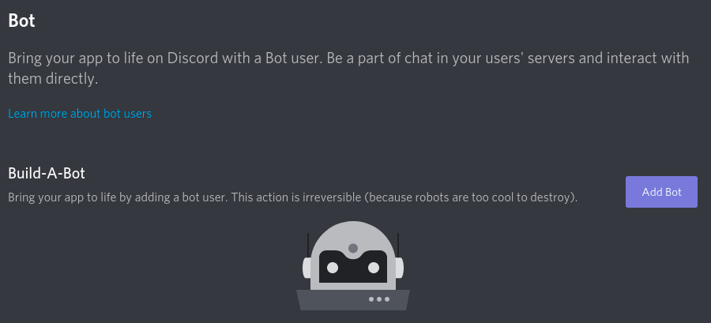

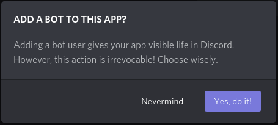

Great Success!

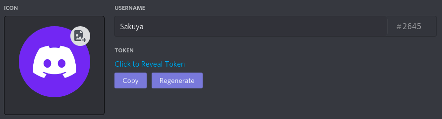

Now that you have a token, you will need it's token to authorize and connect to Discord.

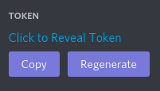

> The token is like your password, do not give it away. Anyone with it can log into your bot.

Before moving forward, I recommend checking out privilege intents. Since they limit what bots can access. I recommend
turning all on for now.

You can find them on the bot tab a little bit down.

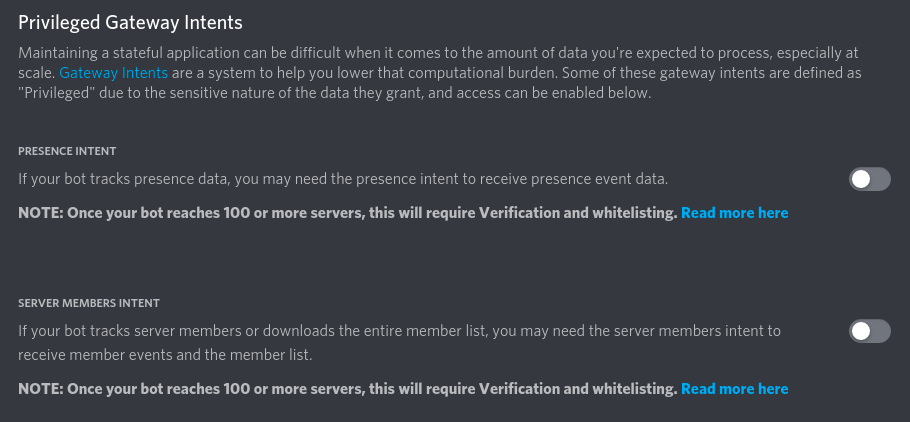

## Inviting your bot

To invite to a guild, first you need a bot invite.

To generate one for your bot, go to the `OAath2` tab.

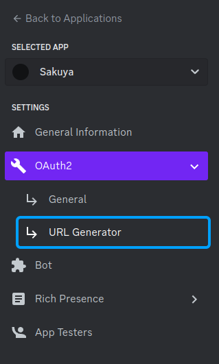

Under `Scopes` select the `bot` permission.

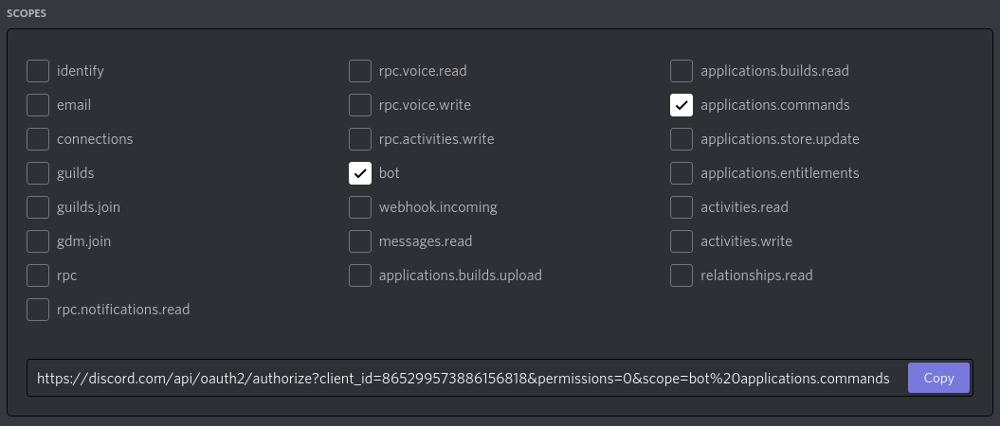

> I also recommend selecting the `applications.commands` one as well for future usages ;)

You can also select permission for the bot to have. If any permission is selected, the bot will get bound role when
inviting it.

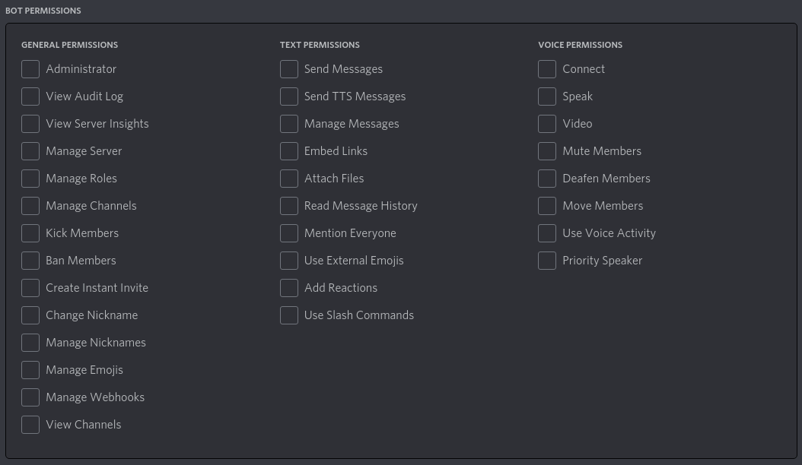

Copy the url and paste it into your browser.

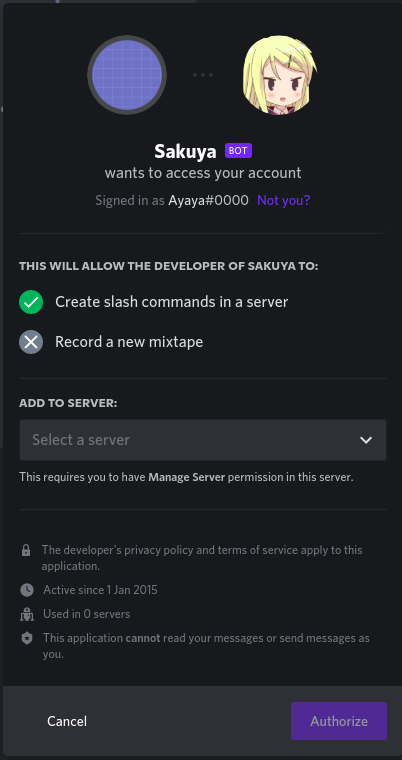

Select a guild to add the bot into and click `Authorize`.

> Your account needs `Manage Server` permission in order to add a bot to it.

Now that you have your bot, you can start writing your bot.
