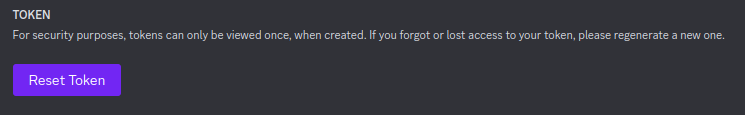
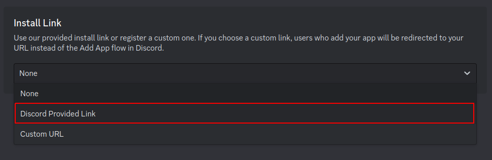
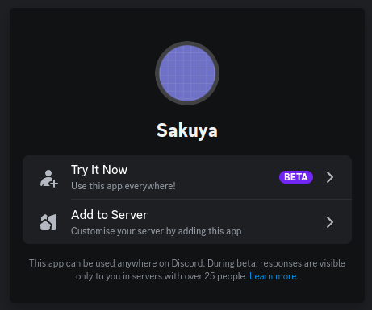

# Getting started

To get started with Discord bots, first you need a discord application and add a bot to it. This tutorial will show to
how to do it.

First go to [Discord developer portal](https://discord.com/developers/applications).

If you have any applications, or teams, they will show up here.

To create one application click on `New Application`, name it and `Create`.

When the application is created, click on the `Bot`.

To authorize the bot with Discord you will need its token. To get the token, we have to `reset` it.

> The token is like your password, do not give it away. Anyone with it can log into your bot.

Turn on `Public bot` check. Even tho it enables others too to add the bot, it also allows you for easier installation.

Before moving forward, I also recommend checking out privilege intents. Since they limit what bots can access.

You can find them on the bot tab a little bit down.

# Inviting your bot

To invite to a guild, first you need a bot invite.

To generate one for your bot, go to the `Installation` tab.

First turn on `user install`, this enables the bot to not only be invited to a guild, but will allow its command
to be integrated with users.

Now select `Discord provided Link` in the `Install Link` section. This allows us to configure how the bot is verified.

Add extra `bot` scope in `Guild Install` section.

Copy the url and paste it into your browser.

Click on `Add to Server`.

Select a guild to add the bot into and click `Authorize`.

> Your account needs `Manage Server` permission in order to add a bot to it.

Now that you have your bot, you can start writing your bot.

# Writing your bot

There are many libraries interacting with the Discord API. Most bot developers stick with the same library for their
whole career, so checking out multiple ones and making a choice, which satisfies needs is highly recommended.

Or if you are enough hardcore to make your own, or you are just curious, check out
[Discord's official documentation](https://discord.com/developers/docs/intro).

----

    <a href="./introduction_to_python.md">Next up: Introduction to Python</a>

